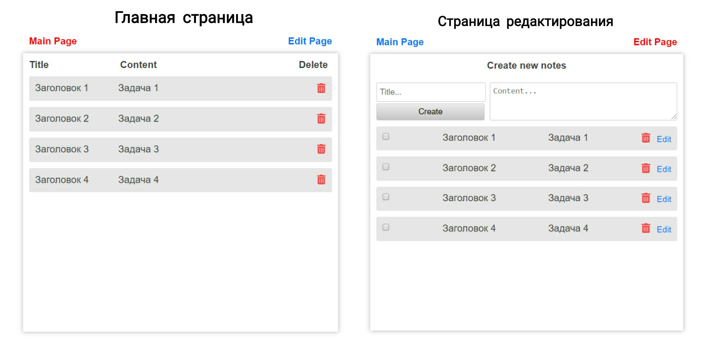
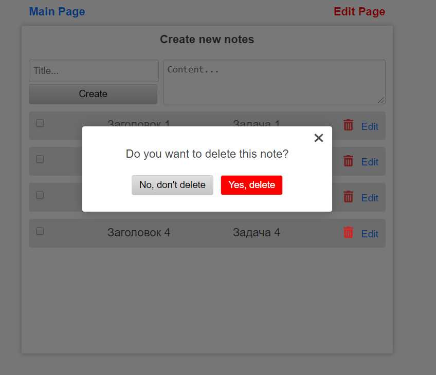

## Preview



## Information

The application consists of only 2 pages. The main page, which displays all the notes and the editing page for creating and editing notes. All actions in the application occur without reloading the page.

All data is stored in LocalStorage, so even if you reload the page, the created notes will not be lost. I also used Vue Router, the official routing library, with which I implemented the navigation.

In those places where you need to use a confirmation (dialog box), I used a modal window. Here's what it looks like:



On the editing page, I added checkboxes, when clicked, the text of the notes becomes strikethrough. A little about the code, the code is very well commented out, the comments and the program itself are in English.

## Deployment

Instructions for deploying the application on the local.

* First you need to copy my repository with this command:

    ```sh
    $ git clone https://github.com/favrora/vue-todo-list.git
    ```

* Next, go to the installed folder in your terminal:

    ```sh
    $ cd vue-todo-list
    ```

* Install all dependencies:

    ```sh
    $ npm install
    ```

* Run server:

    ```sh
    $ npm run serve
    ```

* Open this page: http://localhost:8080/
